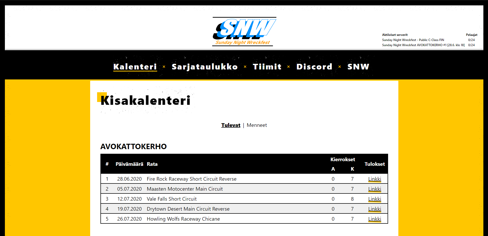

# Sunday Night Wreckfest

Sunday Night Wreckfest is a Finnish gaming community focusing on a game called Wreckfest.

This repository contains a website for the former community. The website can be found running [here](https://sundaynightwreckfest.fi).

## Used technologies

### Server side

- Typescript
- Node.js
- Express
- Google Sheets
- Redis

The server is build on Node.js and uses Express framework for the REST API.

The "database" of the community resides in a Google spreadsheet. This, of course, is not optimal for e developer, but was especifically requested by the client. The client had already some data in an Excel sheet and didn't want to learn new CMS technologies for this purpose. If I, being the only member of the community who takes care of the site, don't have the time to maintain it anymore, the client still will have all the data in a format that makes sense to them.

Quering Google spreadsheets is quite slow and if multiple sheets are queried at once, the loading times get annoyingly long pretty quickly. I implemented a Redis cache in the server so that the spreadsheet queries can be kept to the minimum. The data is saved in redis in the format that the API needs to send to the browser, so the API queries are very quick this way. This means also that the modifications made to the spreadsheet are not seen on the website instantly. There is a specific endpoint that needs to be queried in order to update the cache after modifications.

The website run in a dokku container.

### Client side

- Typescript
- React
- Styled Components

The client side of the project is a React app that uses Typescript and hooks. Styled Components for styling.

## Dev notes

There are some notes and instructions in the `docs` folder.
